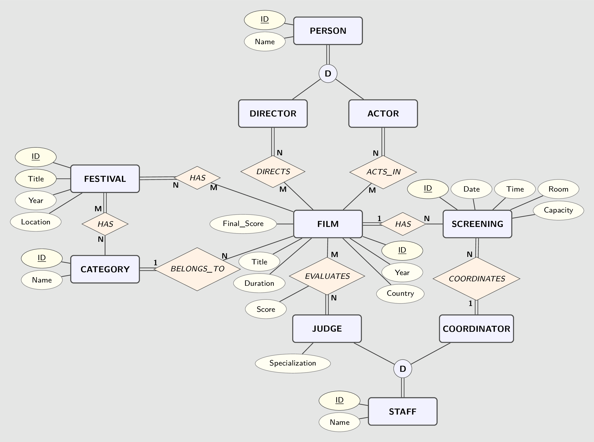

# Design Document

By Arvin Bohlool

GitHub: [Abohlool](https://github.com/Abohlool)

Email: [abohloolk@gmail.com](mailto:abohloolk@gmail.com)

## Scope

* This database is designed for a film festival management system. It allows organizers to manage festivals, films, screenings, and the various people involved (directors, actors, judges, coordinators).

* The database tracks films submitted to festivals along with their categories, directors, and actors. It also manages film screenings including scheduling, room assignments, and coordinator assignments. Evaluation of films by judges with scoring is supported.

* Other aspects such as ticket sales, audience attendance, venue details beyond room names, festival staff beyond judges and coordinators, sponsors, and financial transactions are not managed in this database.

## Functional Requirements

* Add, update, and query festivals with their associated categories and film submissions.
* Manage film records including title, duration, year, country, and category classification.
* Track people involved in films (directors and actors).
* Manage festival staff (judges and coordinators) with specialization tracking for judges.
* Schedule film screenings with date, time, room, capacity, and coordinator assignment.
* Record evaluations (scores) given by judges to films.
* Query films by festival, category, director, actor, or evaluation status.
* Aggregate statistics: film counts per category, average scores, screening counts, judge workload.
* Identify films without evaluations or screenings, and judges without evaluations.
* Order results by various criteria (score, title, screening count, evaluation count).

* No management of ticket sales or audience attendance.
* No tracking of venue details beyond room names.
* No financial transactions or budgeting.
* No sponsor or partner management.

## Representation

Festivals, films, people, staff, screenings, and evaluations are captured in SQLite tables with the following schema.

### Entities

* **Festival**: Core entity representing a film festival event.
  * `id`, `title`, `year`, `location`
  * `title` and `year` form a unique pair to prevent duplicate festival entries.
  * `year` is constrained to be ≥ 1888 (the birth of cinema).
  * `location` defaults to 'unavailable' when not specified.

* **Category**: Represents film categories or genres.
  * `id`, `name`
  * `name` is unique to prevent duplicate categories.

* **Person**: Represents individuals involved in films, either as directors or actors.
  * `id`, `name`, `type`
  * `type` is restricted to 'director' or 'actor' via CHECK constraint.
  * Views `director` and `actor` provide filtered access by type.

* **Staff**: Represents festival personnel, either judges or coordinators.
  * `id`, `name`, `type`, `specialization`
  * `type` is restricted to 'judge' or 'coordinator' via CHECK constraint.
  * `specialization` is only meaningful for judges; CHECK constraint ensures coordinators have NULL specialization.
  * Views `judge` and `coordinator` provide filtered access by type.

* **Film**: Represents a film submitted to festivals.
  * `id`, `title`, `duration`, `year`, `country`, `category_id`, `final_score`
  * `duration` must be positive (> 0).
  * `year` must be ≥ 1888.
  * `final_score` defaults to 0 and is constrained between 0 and 100.
  * FOREIGN KEY references to `category`.

* **Screening**: Represents a scheduled showing of a film.
  * `id`, `date`, `time`, `room`, `capacity`, `film_id`, `coordinator_id`
  * `date`, `time`, and `room` default to NULL.
  * `capacity` must be non-negative.
  * UNIQUE constraint on (`room`, `date`, `time`) prevents double booking a room at the same date and time.
  * UNIQUE constraint on `(coordinator_id, date, time)` prevents scheduling a coordinator for multiple simultaneous screenings.
  * FOREIGN KEY references to `film` (CASCADE delete) and `staff`.

* Use of INTEGER PRIMARY KEY AUTOINCREMENT for surrogate keys.
* Use of TEXT for names, titles, and descriptive fields to allow flexibility.
* Use of CHECK constraints to enforce data integrity (valid years, positive durations, valid types, score ranges).
* Use of UNIQUE constraints to prevent duplicate entries (festival title+year, category name).

### Relationships

<!-- markdownlint-disable-next-line MD033 -->

* **Festival-Category (M:N)**: A festival can have multiple categories, and a category can appear in multiple festivals. Implemented via `festival_category` junction table with composite primary key `(festival_id, category_id)`.

* **Festival-Film (M:N)**: A festival can screen multiple films, and a film can be submitted to multiple festivals. Implemented via `festival_film` junction table with composite primary key `(festival_id, film_id)`.

* **Film-Category (N:1)**: Each film belongs to exactly one category. A category can have many films. Implemented via `category_id` foreign key in the `film` table.

* **Film-Director (M:N)**: A film can have multiple directors, and a director (person) can direct multiple films. Implemented via `film_director` junction table with composite primary key `(film_id, director_id)`.

* **Film-Actor (M:N)**: A film can have multiple actors, and an actor (person) can act in multiple films. Implemented via `film_actor` junction table with composite primary key `(film_id, actor_id)`.

* **Film-Screening (1:N)**: A film can have multiple screenings. A screening belongs to exactly one film. Implemented via `film_id` foreign key in the `screening` table with CASCADE delete.

* **Coordinator-Screening (1:N)**: A coordinator (staff) can be assigned to multiple screenings. Each screening has exactly one coordinator. Implemented via `coordinator_id` foreign key in the `screening` table.

* **Judge-Evaluation (M:N with attributes)**: A judge evaluates multiple films, and a film is evaluated by multiple judges. The evaluation includes a `score` attribute. Implemented via `evaluation` table with composite primary key `(judge_id, film_id)`.

## Optimizations

* **Views for simplified data access**:
  * `director` view: Filters `person` table to show only directors.
  * `actor` view: Filters `person` table to show only actors.
  * `judge` view: Filters `staff` table to show only judges with their specializations.
  * `coordinator` view: Filters `staff` table to show only coordinators.

* **Indexes to improve query performance**:
  * `idx_film_title` on `film(title)`: Accelerates searches and ordering by film title.
  * `idx_person_type_name` on `person(type, name)`: Speeds up filtering by type (director/actor) combined with name lookups and ordering.

## Limitations

* **No detailed film metadata**: The system does not store trailers, languages, production companies, or budget information.
* **No ticketing or attendance**: The database does not track ticket sales, audience numbers, or seat reservations for screenings.
* **No venue management**: Beyond simple room names, there is no tracking of venue addresses, seating layouts, or equipment.
* **Limited staff roles**: Only judges and coordinators are represented; other staff roles (organizers, volunteers, technical crew) are not modeled.
* **No awards or competition tracking**: The database stores scores but does not manage award categories, winners, or competition rules.
* **No user authentication**: The database schema does not include user accounts or access control for festival staff using the system.
